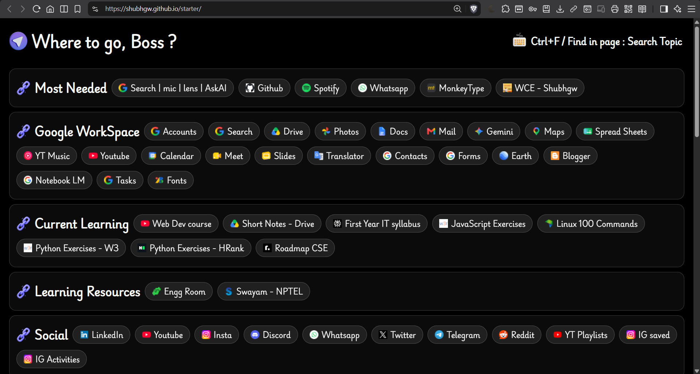

# 🙏 Welcome to the README of <a href="https://shubhgw.github.io/starter">Starter</a> Page 👈

## <a href="https://shubhgw.github.io/portfolioshubhgw"> 🌐 Starter site : https://shubhgw.github.io/starter </a>

### 🎨 I kept this simple in terms of UI , 😁

### 🎨 U can customize it according to your needs & use cases. 😁

## ✅ Most Needed

## ✅ Google WorkSpace

## ✅ Current Learning

## ✅ Learning Resources

## ✅ Social

## ✅ AI tools

## ✅ Development

## ✅ Productivity

## ✅ Top AI chats

## ✅ Mine Github Repos

## ✅ Usefull Github Repos

## ✅ Important AI commands

## ✅ Github Tricks

## ✅ Logo Fonts

## ✅ Leetcode premium

## ✅ Design themes

## ✅ Tech Benefits

## ✅ About Hackathons & Competitions

## ✅ Others

## I keep updating it according to mine needs.

<pre>
Directory structure:
└── shubhgw-starter/
    ├── README.md
    ├── index.html
    ├── styles.css
    ├── assets/
    |   └── images/
    |    |    ├── findinpage.png
    |    |    ├── go.png
    |    |    ├── keyboard.png
    |    |    └── link.png
    |    └── gifs/
    |        └── keybaord-animation.mp4
    └── .github/
        └── workflows/
            └── static.yml
</pre>

### 🙌 Thanks for the Visit !
